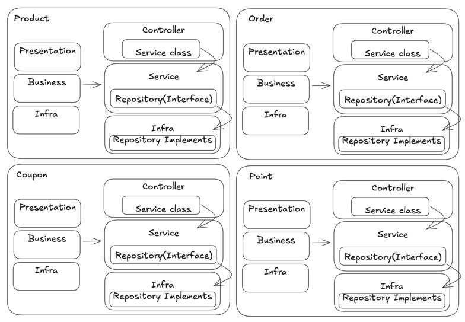

## 프로젝트

## Getting Started

### Prerequisites

#### Running Docker Containers

`local` profile 로 실행하기 위하여 인프라가 설정되어 있는 Docker 컨테이너를 실행해주셔야 합니다.

```bash
docker-compose up -d
```


### Architecture

#### Package Structure
```Java
order
├── application
    ├── service(usecase)
    ├── repository(interface)
    └── dto
├── domain
├── infrastructure
    ├── entity
    └── repository(implementation)
├── presentation
└── common
point
├── application
    ├── service(usecase)
    ├── repository(interface)
    └── dto
├── domain
├── infrastructure
├── presentation
└── common
product
├── application
    ├── service(usecase)
    ├── repository(interface)
    └── dto
├── domain
├── infrastructure
├── presentation
└── common
coupon
├── application
    ├── service(usecase)
    ├── repository(interface)
    └── dto
├── domain
├── infrastructure
    ├── entity
    └── repository(implementation)
├── presentation
└── common
```
- 각 도메인 별 상위 패키지 구조, 최대한 도메인 별로 분리
- 하위에는 application, domain, infrastructure, presentation이 있음
  - application : UseCase에 해당하는 서비스 클래스와 DB 영속성을 위한 repository 인터페이스가 있음, 각 서비스에서는 interface를 참조하고 구현체 의존성 주입으로 DIP를 지키려고 했음
  - domain: 도메인 규칙을 책임지는 domain 클래스와 JPAEntity 클래스를 분리, persistence context 접근과 비즈니스 규칙, 상태변화 등의 관심사를 분리 
  - infrastructure: 외부 모듈에 접근하기 위한 레이어 패키지
  - entity: domain과 분리된 entity class들의 집합, 책임, 관심사 분리

#### Layered Architecture(Interface)

각 상위 패키지별 묶어서 그렸고 Controller에서는 각 Service class를 의존성 주입받지만 각 서비스 클래스 내에서는 Repository interface를 가지고 구현체를 주입 받도록 해서 의존성의 방향이 한쪽으로 흐르게 했습니다