## 📝 Step 3. 요구사항 정의 및 시퀀스 다이어그램, ERD 설계
👉🏻[요구사항 정의](https://github.com/MinjiY/ecommerce-practice/blob/step03/specification.md#-요구사항-정의)   
👉🏻[이벤트 스토밍](https://github.com/MinjiY/ecommerce-practice/blob/step03/specification.md#-이벤트-스토밍)   
👉🏻[시퀀스 다이어그램](https://github.com/MinjiY/ecommerce-practice/blob/step03/specification.md#-시퀀스다이어그램)   
👉🏻[ERD 설계](https://github.com/MinjiY/ecommerce-practice/blob/step03/specification.md#-erd-설계)   

## 💻 Step 4. Mock API, Swagger-UI 
👉🏻[Mock API](https://github.com/MinjiY/ecommerce-practice/blob/step04/specification.md#1-mock-api)   
👉🏻[Swagger-UI](https://github.com/MinjiY/ecommerce-practice/blob/step04/specification.md#2-swagger-ui)

---
## 📖 시나리오
### 주문 시나리오
사용자는 상품을 선택하여 주문을 위해 주문서 작성으로 넘어간다.
주문서 작성중에 쿠폰을 사용하고 싶다면 모달을 띄워 현재 사용 가능한 쿠폰을 조회한다, 사용 가능한 쿠폰은 여러개일 수 있다.
사용 가능한 쿠폰을 확인하고 리스트 중 사용할 쿠폰을 선택해서 현재 결제 금액에 할인된 금액을 적용한다.
결제를 위해서는 충전된 금액이 있어야 하며, 충전된 금액이 부족하면 결제를 할 수 없다.
결제 금액이 충전된 금액보다 크면 결제할 수 없다는 메시지를 띄운다.

### 쿠폰 시나리오
1. 쿠폰 사용   
쿠폰 사용의 시점은 **주문서를 작성할 때** "사용 가능 쿠폰"을 조회하여 사용할 수 있다.   
사용 가능 쿠폰을 조회하면 유저가 사용할 수 있는 쿠폰의 리스트 조회하여 모달에 보여준다.   
그 중 하나만 선택할 수 있다.
하나의 주문 당 쿠폰은 하나만 사용 가능하다.
쿠폰 사용은 주문 생성 API에 포함하지 않고 쿠폰 사용 API를 따로 호출한다.
주문서를 생성할때 쿠폰 사용 API를 함께 호출하지 않고 "사용 가능 쿠폰" 모달에서 "쿠폰 적용" 하면 호출한다.

쿠폰 생성은 admin의 역할


2. 쿠폰 발급
사용자는 선착순으로 쿠폰을 발급받으며 100명이 발급받으면 101명부터는 쿠폰 발급이 실패한다.
발급 페이지에 접속을 위해 대기열에 태우는 것이 아닌 발급 호출시 비즈니스 규칙을 모두 검사 후 태운다.

3. 쿠폰 만료
스케줄러로 매 자정에 쿠폰 만료 서비스가 호출된다.

4. 쿠폰 사용 취소
주문서 작성을 취소하면 쿠폰 사용도 취소 API를 호출한다.
주문 취소 또는 환불시 쿠폰 사용 취소 API를 호출한다.
주문 생성 중 에러 발생시 쿠폰 사용 취소 서비스가 비동기로 호출된다.

## 📄 요구사항 정의
### 기능 요구사항
- 사용자는 결제에 사용될 금액을 충전한다.
- 고객이 상품을 주문한다.
- 주문하기 위해 충전된 금액으로 결제한다.
- 상품 다중선택으로 주문할 수 있다.
- 주문(결제)시 잔액을 차감한다.
- 주문이 완료되면 주문완료 상태로 전환된다.
- 주문이 완료되면 주문한 상품의 재고가 감소한다.
- 사용자는 자신의 잔액을 조회한다.
- 상품을 조회할 수 있다. (ID, 이름, 가격, 잔여수량)
- 사용자는 최근 3일간 가장 많이 팔린 상위 5개 상품을 조회한다.
- 사용자는 자신의 주문 상태를 확인한다.
- 주문을 취소하면 취소한 금액이 충전 잔액에 더해진다.
- 주문을 취소하면 재고가 다시 증가한다.
- 주문을 취소하면 쿠폰이 다시 사용가능 상태가 된다.
- 주문을 취소하면 주문취소 상태로 전환된다.
- 사용자는 선착순으로 쿠폰을 발급받는다.
- 쿠폰 100명의 선착순시 101명부터 쿠폰 발급은 실패해야한다.
- 쿠폰 사용시 전체 주문금액을 할인 받는다.
- 쿠폰은 만료시간에 만료된다.
- 쿠폰은 주문당 1개 사용한다.
- 주문할때 쿠폰 사용시, 할인 받은 금액만큼 충전금액을 차감한다.
- 사용자는 보유 쿠폰을 조회한다.

### 비기능 요구사항
- 트랜잭션
    - 주문 성공시 재고차감은 비동기적으로 반영한다.
    - 주문 성공시 주문 완료상태가 되어야 한다.
    - 주문이 실패하면 금액차감이 실패해야한다.
    - 금액이 부족하면 주문할 수 없다.
    - 주문 취소시 충전 잔액 증가가 실패하면 주문취소도 실패한다.
    - 모든 트랜잭션 실패는 Retry 3회 시도해야한다.
- 장애격리
    - 충전된 금액이 조회되지않으면 주문할 수 없다.
    - 주문(결제)시스템이 과중되면 사용자를 잠시 받지않고 결제를 잠시후에 하도록 유도한다. (Circuit breaker, fallback)
    - 최근 3일간 가장 많이 팔린 상위 5개 상품을 조회할 수 없다면 사용자가 가장 많이 구입했던 상품 카테고리에 해당하는 상품을 랜덤하게 추천한다.
- 성능
    - 시간당 평균 이용자가 10만명이라고 할때, 주문(결제)는 초당 1000명까지 요청 가능해야한다.

---
## 📊 이벤트 스토밍
1. 도메인 이벤트 도출
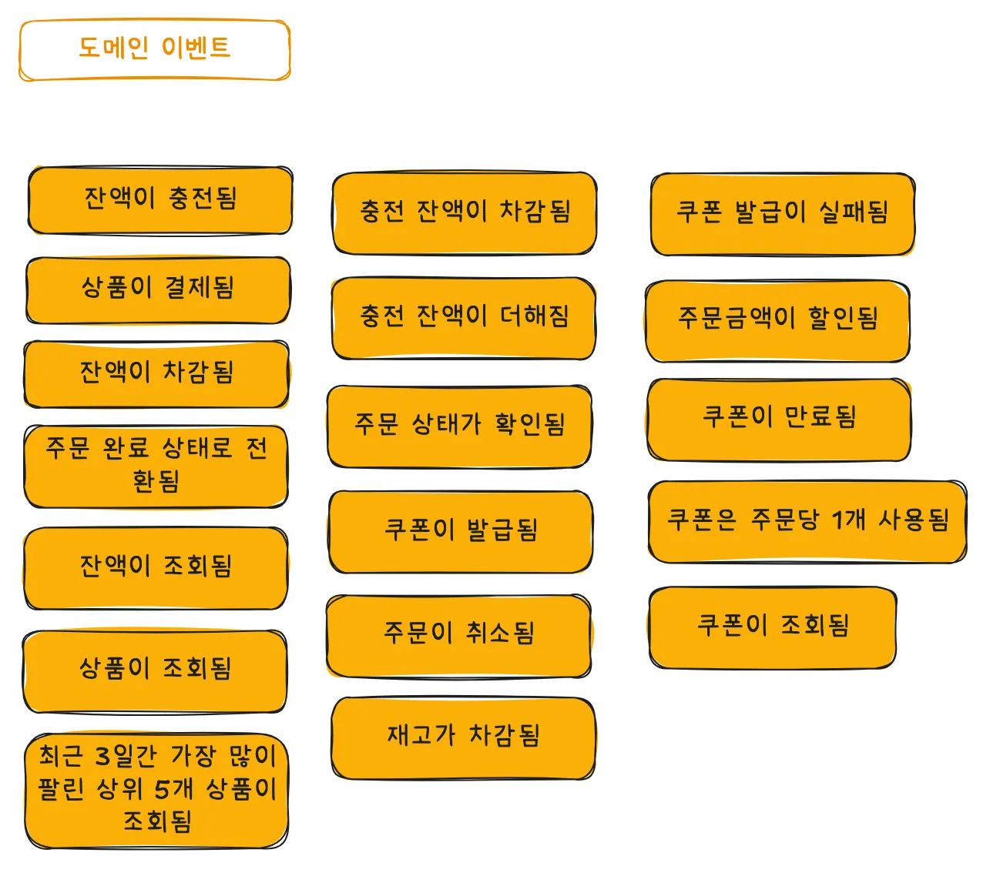

2. 커맨드 도출 (이벤트를 트리거하는 행동)
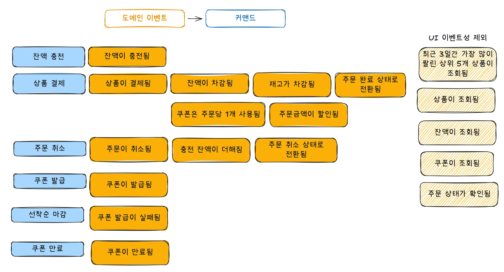

3. 액터 도출
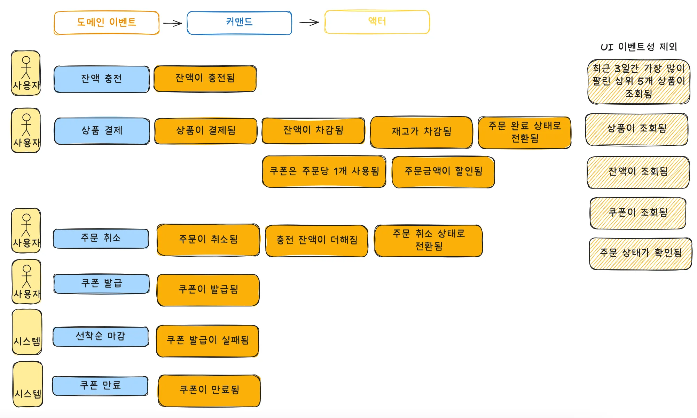

4. 외부서비스 도출
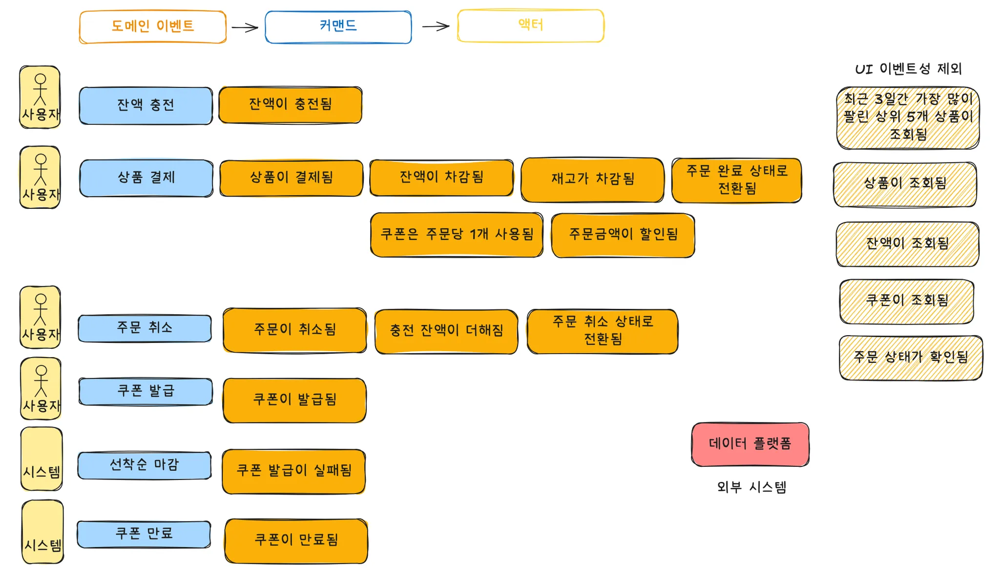

5. 어그리게이터 도출 (상태가 변경되는 데이터 묶음, 연관되는 엔티티와 값 객체의 묶음)
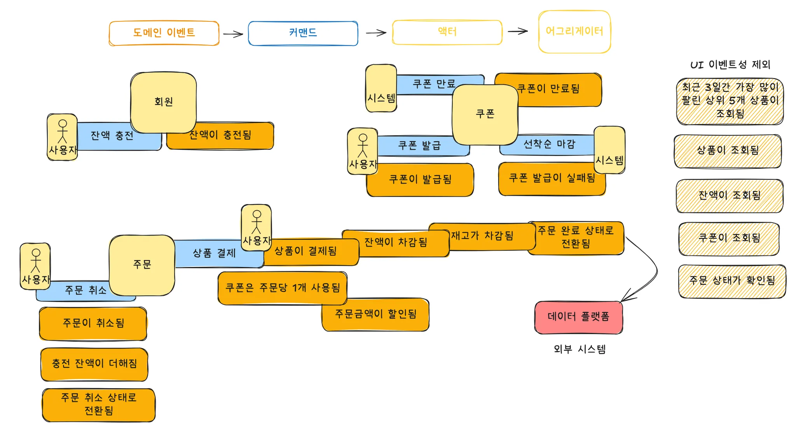

6. Bounded Context 정의
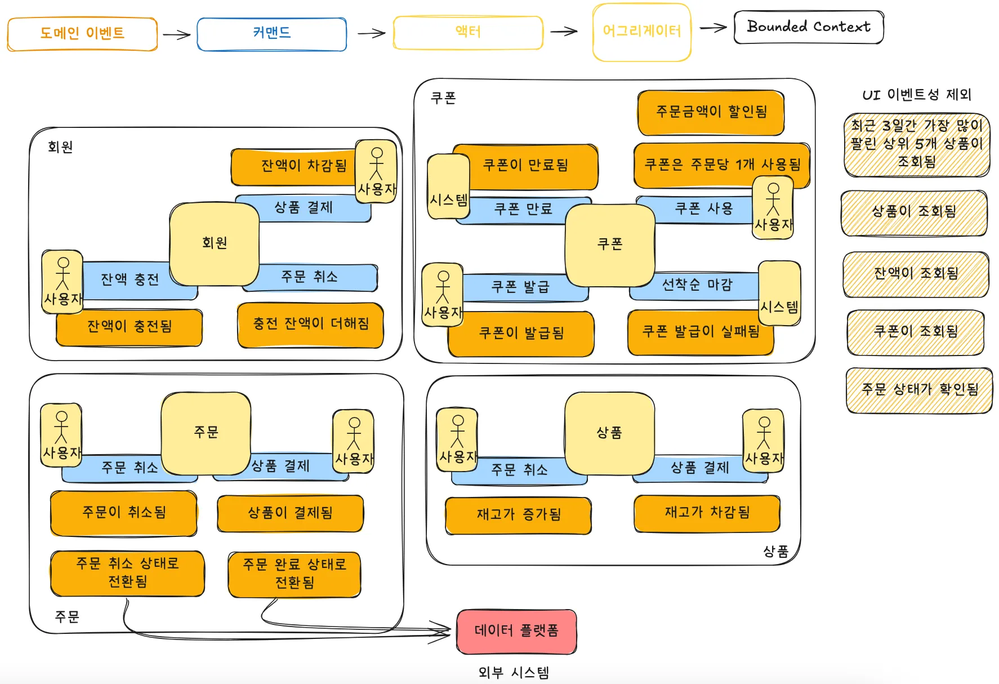

7. 정책 도출
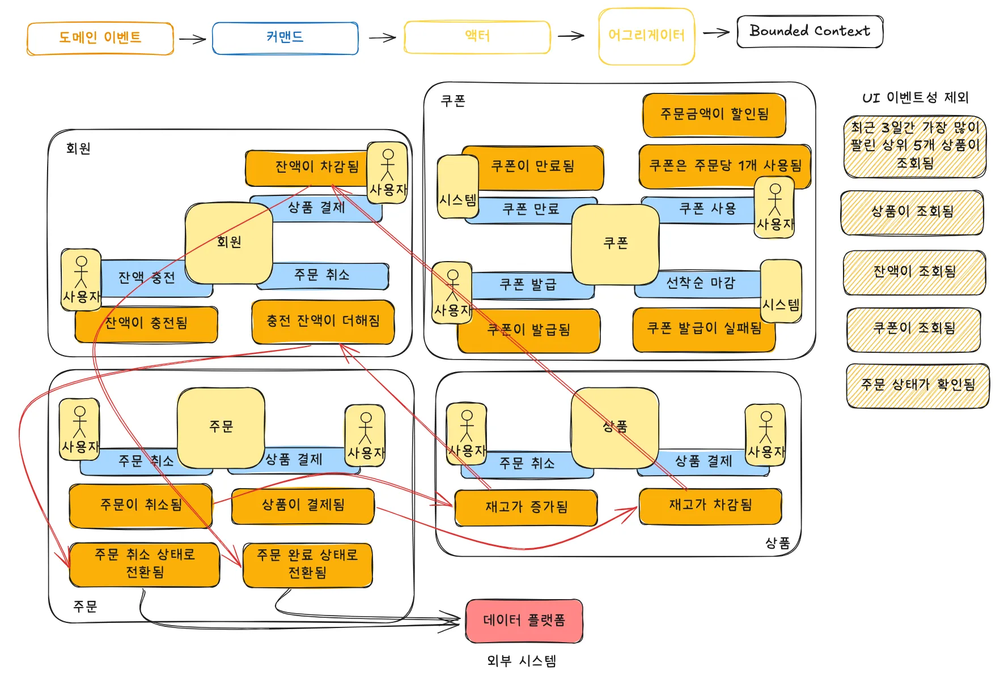

8. 호출관계 명확하게 하기
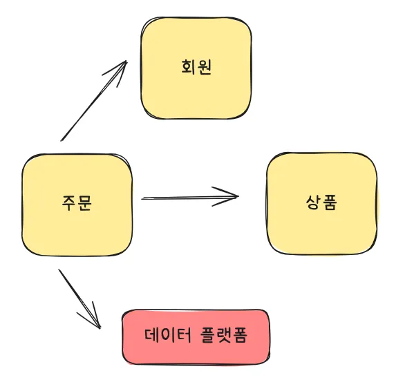


## 📌 시퀀스다이어그램

### 1. 금액 충전
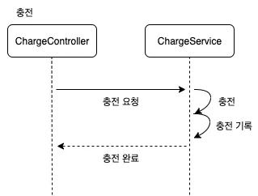

### 2. 상품 주문
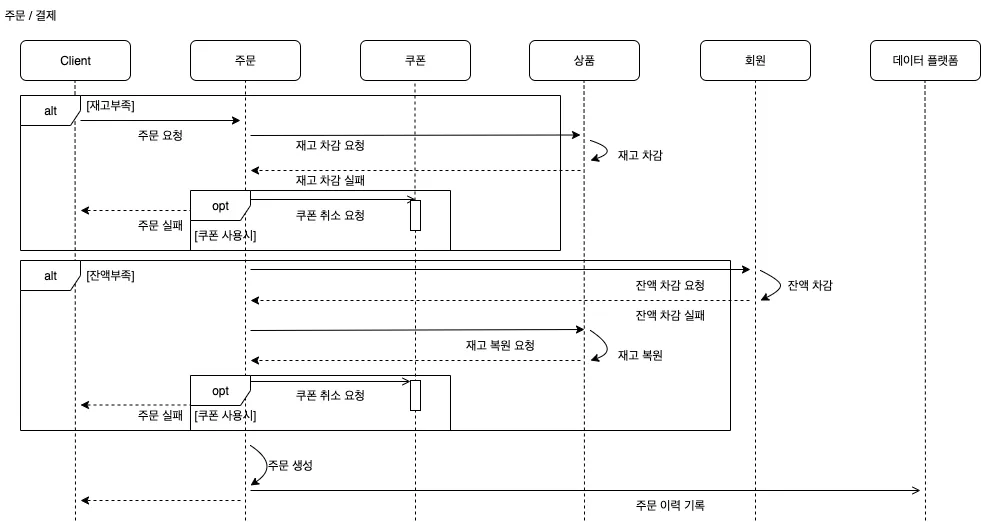

### 3. 쿠폰 발급
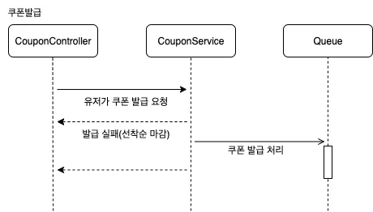

### 4. 쿠폰 만료
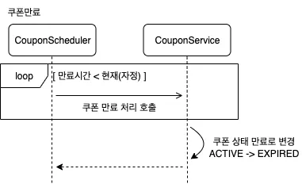


---
## 👩‍💻 ERD 설계
[DDL 파일](https://github.com/MinjiY/ecommerce-practice/blob/step03/ddl.sql)
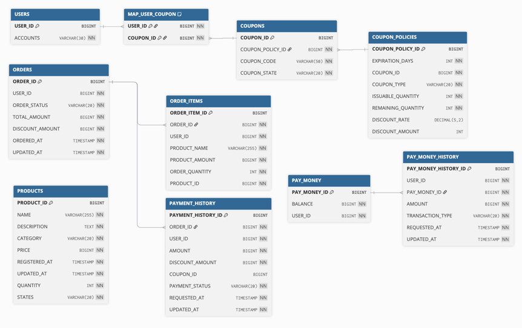   
- 하나의 쿠폰을 여러 사용자가 발급받을 수 있다.
- 한명의 사용자는 여러 쿠폰을 발급받을 수 있다.   
=> `MAP_USER_COUPON` 테이블을 통해 다대다 관계를 표현한다.
- 하나의 쿠폰 정책을 여러 쿠폰이 가질 수 있다.   
=> ex) 1월 30% 할인 쿠폰, 선착순 30% 할인쿠폰


<details><summary> DDL </summary>

```sql
CREATE TABLE USERS
(
  USER_ID  BIGINT AUTO_INCREMENT PRIMARY KEY,
  ACCOUNTS VARCHAR(30) NOT NULL
);
CREATE TABLE COUPON
(
  COUPON_ID          BIGINT AUTO_INCREMENT PRIMARY KEY,
  COUPON_NAME        VARCHAR(50) NOT NULL,
  EXPIRATION_DATE    DATE        NOT NULL,
  ISSUABLE_QUANTITY  INT         NOT NULL, -- 발급 가능한 쿠폰 수량
  ISSUED_QUANTITY    INT         NOT NULL, -- 발급된 쿠폰 수량
  REMAINING_QUANTITY INT         NOT NULL, -- 남은 쿠폰 수량
  DISCOUNT_RATE      DECIMAL(5, 2)
);
CREATE TABLE MAP_USER_COUPON
(
  USER_ID            BIGINT NOT NULL,
  COUPON_ID          BIGINT NOT NULL,
  COUPON_STATE       VARCHAR(20) NOT NULL, -- ACTIVE, USED, EXPIRED
  COUPON_NAME        VARCHAR(50) NOT NULL,
  PRIMARY KEY (USER_ID, COUPON_ID)
);
CREATE TABLE ORDERS
(
  ORDER_ID        BIGINT AUTO_INCREMENT PRIMARY KEY,
  USER_ID         BIGINT      NOT NULL,
  ORDER_STATUS    VARCHAR(20) NOT NULL, -- COMPLETED, CANCELED
  TOTAL_AMOUNT    BIGINT      NOT NULL, -- 총 주문 금액
  DISCOUNT_AMOUNT BIGINT      NOT NULL, -- 할인 금액
  PAID_AMOUNT     BIGINT      NOT NULL, -- 결제 금액 (총 주문 금액에서 할인받은 금액)
  ORDER_DATE      DATE        NOT NULL,
  UPDATE_DATE     DATE        NOT NULL,
  ORDERED_AT      TIMESTAMP   NOT NULL,
  UPDATED_AT      TIMESTAMP   NOT NULL
);
CREATE TABLE ORDER_ITEM
(
  ORDER_ITEM_ID  BIGINT AUTO_INCREMENT PRIMARY KEY,
  ORDER_ID       BIGINT       NOT NULL,
  USER_ID        BIGINT       NOT NULL,
  PRODUCT_NAME   VARCHAR(255) NOT NULL,
  PRODUCT_AMOUNT BIGINT       NOT NULL,
  ORDER_QUANTITY INT          NOT NULL,
  PRODUCT_ID     BIGINT       NOT NULL,
  ORDER_DATE     DATE         NOT NULL,
  UPDATE_DATE    DATE         NOT NULL,
  ORDERED_AT      TIMESTAMP   NOT NULL,
  UPDATED_AT      TIMESTAMP   NOT NULL,
  FOREIGN KEY (ORDER_ID) REFERENCES ORDERS (ORDER_ID)
);
CREATE TABLE PAYMENT_HISTORY
(
  PAYMENT_HISTORY_ID BIGINT AUTO_INCREMENT PRIMARY KEY,
  USER_ID            BIGINT      NOT NULL,
  AMOUNT             BIGINT      NOT NULL,
  DISCOUNT_AMOUNT    BIGINT      NOT NULL,
  PAID_AMOUNT         BIGINT      NOT NULL, -- 결제 금액 (총 주문 금액에서 할인받은 금액)
  COUPON_ID          BIGINT,
  PAYMENT_STATUS     VARCHAR(20) NOT NULL, -- SUCCESS, CANCELED
  ORDER_DATE         DATE        NOT NULL,
  UPDATE_DATE        DATE        NOT NULL,
  ORDERED_AT         TIMESTAMP   NOT NULL,
  UPDATED_AT         TIMESTAMP   NOT NULL
);
CREATE TABLE PRODUCT
(
  PRODUCT_ID    BIGINT AUTO_INCREMENT PRIMARY KEY,
  NAME          VARCHAR(255) NOT NULL,
  DESCRIPTION   TEXT         NOT NULL,
  CATEGORY      VARCHAR(20)  NOT NULL, --
  PRICE         BIGINT       NOT NULL,
  CREATED_AT    TIMESTAMP    NOT NULL,
  UPDATED_AT    TIMESTAMP    NOT NULL,
  QUANTITY      INT          NOT NULL,
  PRODUCT_STATE        VARCHAR(20)  NOT NULL  -- AVAILABLE, SOLD_OUT
);
CREATE TABLE POINT
(
  POINT_ID     BIGINT AUTO_INCREMENT PRIMARY KEY,
  BALANCE      BIGINT NOT NULL,
  USER_ID      BIGINT NOT NULL
);
CREATE TABLE POINT_HISTORY
(
  POINT_HISTORY_ID     BIGINT AUTO_INCREMENT PRIMARY KEY,
  USER_ID              BIGINT      NOT NULL,
  POINT_ID             BIGINT      NOT NULL,
  AMOUNT               BIGINT      NOT NULL,
  TRANSACTION_TYPE     VARCHAR(20) NOT NULL, -- DEPOSIT, WITHDRAW
  CREATED_AT           TIMESTAMP   NOT NULL,
  UPDATED_AT           TIMESTAMP   NOT NULL,
  FOREIGN KEY (POINT_ID) REFERENCES POINT (POINT_ID)
);
```

</details>
---

## 💎 Mock API

### 1. Mock API
[커밋링크](https://github.com/MinjiY/ecommerce-practice/commit/9c8502869767454cac46e7d568dd08a9f02bf72b)
### 2. Swagger-UI
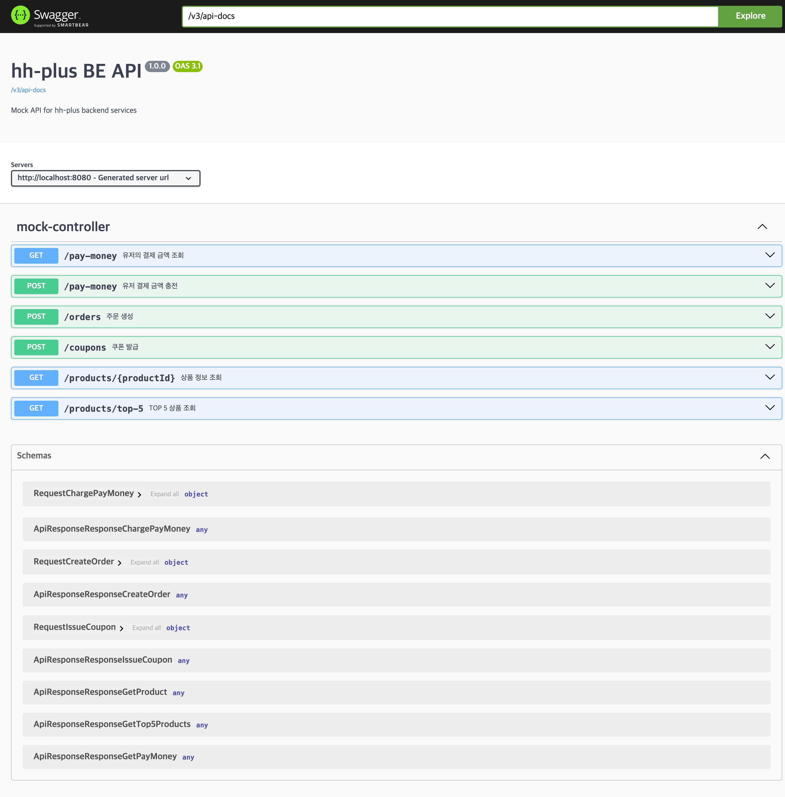


